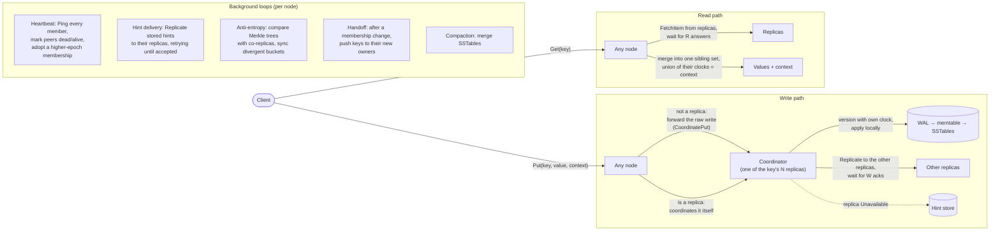

# Distributed KV Store

A Dynamo-style, leaderless key-value store written from scratch in Go. It
favours availability over consistency (AP): any node accepts reads and writes,
and replicas converge in the background.

- **Consistent hashing with virtual nodes** places each key on N replicas.
- **Tunable N/W/R quorums**: a write succeeds once W replicas have it, a read
  once R have answered.
- **Vector clocks with siblings**: concurrent writes are both kept and
  returned together, and a client resolves them by writing back with the
  context it read.
- **LSM storage** per node: a write-ahead log, a memtable, immutable SSTables
  with Bloom filters, and tiered compaction.
- **Hinted handoff**: a write a replica missed while it was unreachable is
  kept on disk by the coordinator and delivered when the replica answers again.
- **Merkle-tree anti-entropy**: replicas compare trees and exchange only the
  keys in buckets that differ.
- **Dynamic membership**: nodes are added and removed through epoch-versioned
  memberships that spread by heartbeat, and the data each node no longer owns
  is handed off to its new owners.

## Status

This is a learning and portfolio project, not a production database. It has
no authentication or encryption, no client-facing delete, and several known
gaps in what it guarantees during failures and membership changes. **Read
[docs/known-limitations.md](docs/known-limitations.md) before drawing
conclusions from anything below.**

## Architecture

Every node runs the same process (`cmd/node`): a gRPC server for clients and
for other nodes, an HTTP server for probes and the admin API, and a set of
background loops.



## Package map

| Package | Purpose |
|---|---|
| `cmd/node` | The node binary: loads a YAML config and runs one node until SIGINT/SIGTERM. |
| `internal/app` | Wires a config into a running node: probe server and admin API, node, gRPC listener, background loops, ordered shutdown. |
| `internal/config` | Loads and validates the YAML config (`KV_NODE_ID` overrides `nodeId`). |
| `internal/node` | The node itself: coordination, forwarding, quorums, hints, anti-entropy, heartbeats, membership and handoff. |
| `internal/rpc` | gRPC server and client for the client API (`KVClient`) and node-to-node API (`KVReplication`). |
| `internal/rpc/pb` | The `.proto` file and its generated code (checked in). |
| `internal/hashring` | Consistent-hash ring with virtual nodes; gives each key its preference list. |
| `internal/vectorclock` | Vector clocks and how two of them compare (before, after, equal, concurrent). |
| `internal/versioning` | Sibling resolution: which versions a new one supersedes, and merging sibling sets. |
| `internal/model` | `DataItem`: a value, its vector clock and its tombstone flag. |
| `internal/store` | The versioned key-value store a node writes to, in memory or on the storage engine. |
| `internal/hints` | Durable store of hinted-handoff writes, on its own storage engine. |
| `internal/identity` | The data directory's incarnation, which makes a node's clock ID unique to its data. |
| `internal/merkle` | Merkle trees over key buckets, and finding the buckets where two trees differ. |
| `internal/storage/engine` | The LSM engine: ties WAL, memtable, SSTables, manifest and compaction together. |
| `internal/storage/wal` | Write-ahead log, replayed on open. |
| `internal/storage/memtable` | The in-memory sorted table that is flushed to an SSTable when full. |
| `internal/storage/sstable` | Immutable sorted files with an index and a Bloom filter. |
| `internal/storage/compaction` | Picks a tier of SSTables to compact and merges them. |
| `internal/storage/manifest` | Records which SSTables are live. |
| `internal/storage/fsutil` | Atomic file writes and directory fsync. |
| `e2e` | End-to-end tests that run real `cmd/node` processes. |

## Quick start

Needs the Go version in `go.mod` and, to talk to the nodes,
[grpcurl](https://github.com/fullstorydev/grpcurl). Build the node binary and
start a 3-node cluster (`n=3, w=2, r=2`), each node in its own terminal, from
the repository root:

```sh
go build -o kvnode ./cmd/node        # kvnode.exe on Windows

./kvnode -config examples/local/node-1.yaml
./kvnode -config examples/local/node-2.yaml
./kvnode -config examples/local/node-3.yaml
```

Write through one node and read through another:

```sh
grpcurl -plaintext -d '{"key": "greeting", "value": "hello"}' localhost:7000 kvstore.KVClient/Put
grpcurl -plaintext -d '{"key": "greeting"}' localhost:7001 kvstore.KVClient/Get
```

[docs/running-locally.md](docs/running-locally.md) covers probes, the data
directories, concurrent writes and siblings, and what each error means.

## Changing membership

Nodes are added and removed one at a time, each change at a higher epoch,
through the config of a new node or `POST /admin/membership`; `GET
/admin/handoff` says when a change has finished moving data. The procedure,
including removing a crashed node, is in [docs/membership.md](docs/membership.md).

## Testing

```sh
go test -race -count=1 ./...
```

Most packages have their own tests, and many tests run several nodes in one process
over real gRPC. The `e2e` package builds `cmd/node` and runs real processes: it
kills a whole cluster and checks every acknowledged write survives, shows hints
alone carrying writes to a replica that was dead, adds and removes a node and
checks where every key physically ends up, and stops a node with SIGTERM.

The suite runs on Windows and on Linux (in the `golang:1.26` container; the
SIGTERM test is skipped on Windows). There is no CI. Details, and what the
crash tests do not prove, are in [docs/testing.md](docs/testing.md).

## Key design decisions

- **Only replicas version writes.** A node that isn't a replica forwards the
  raw write, so a vector clock records who stored data, never who routed it.
- **Clock IDs are `node#incarnation`.** A node replaced with an empty data
  directory under the same ID starts a new clock entry, instead of restarting
  its predecessor's counter, which replicas would drop as an older write.
- **Handoff never deletes.** Copying can be interrupted and repeated safely;
  the cost is that former owners keep orphaned copies.
- **Membership is epoch-versioned and fingerprinted.** A higher epoch wins, and
  the fingerprint (members, addresses, N, vnodes, ring scheme) makes two
  different memberships at the same epoch a reported conflict, not a guess.
- **A failed write has an unknown outcome.** Rollback is local only, so a
  replica may already hold the write; retrying with the same context is safe
  and at worst adds a duplicate sibling.

## Roadmap

- Fix the cold-start window in which a node fails writes to peers that started
  after it: an inbound `Ping` should mark its sender alive and reset the
  connection's reconnect backoff (see
  [known-limitations.md](docs/known-limitations.md)).
- Run the cluster on Kubernetes as a StatefulSet.
- A Kubernetes Operator to manage the cluster.
- Load tests with k6.

## Documentation

[docs/README.md](docs/README.md) lists every document and what it is for.
